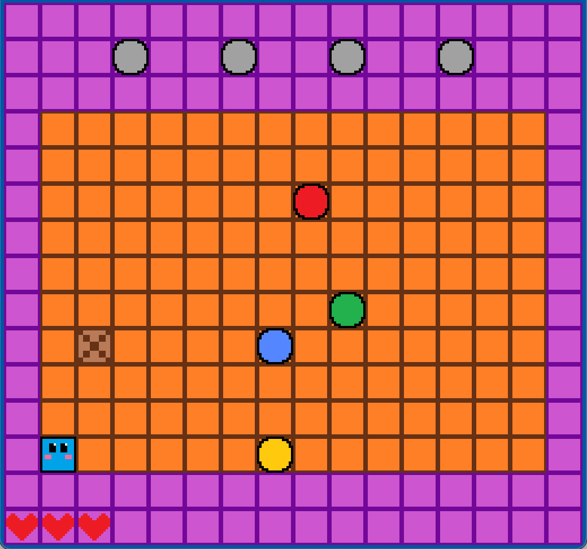

# KaraSoko

**Author:** Angela Zhang

**Design:** KaraSoko is a puzzle game based on the box-pushing game (Sokoban) with memory game elements. Along with having to push the box around, player must also memorize a sequence of colors and manipulate the box to pass over corresponding colored buttons in the given order.

## Screen Shot



## How Your Asset Pipeline Works

Art created in https://www.pixilart.com/draw# and exported into a .png format. These png files are stored in the `assets` folder.

`asset_processing.cpp` is responsible for converting these png files into a readable format by the PPU. We read in all png files, and for each one, we split the image into blocks of 8 (the size of a tile) and extract the palette colors and tile patterns from this block. If there are any invalid images (i.e. has more than 4 colors that wouldn't fit in a palette) or more images than expected, we throw an error.

For each image, we create a `LoadedSprite`, which stores each of these 8x8 blocks, their tile index, and their relative locations. It also contains the name for the sprite (taken from the png file name) and a function that draws out the entire sprite given a position and reference to the ppu.

To process all the assets, you need to run in the `15-466-game1` directory:
```
% jam && assets/LoadAssets
```

This will output chunk files into `dist/resources` containing the tile table, palette table, and a table of sprite information. These chunks are loaded when running the game; the tile table and palette table are stored in the ppu, and the `LoadedSprite` is loaded into a map from the sprite name to the `LoadedSprite` called `sprite_mapping`. When a sprite needs to be drawn, we use `sprite_mapping` to get the corresponding sprite and all the information related to it.

## How To Play

Compile and run the game by running in the `15-466-game1` directory:
```
% jam && dist/KaraSoko
```

The lights at the top of the screen will flash a predetermined sequence of colors. The player must move the box over the buttons on the floor in the order of the color flashes. A failed sequence will cost a life, and the player must achieve the highest score possible before losing all of their lives.

The player can be controlled using the arrow keys (up, down, left, right). The box can be pushed by moving into the box, or pulled by pressing F while in the same row/column.

**Sources:** None, all assets were created in https://www.pixilart.com/draw#

This game was built with [NEST](NEST.md).

